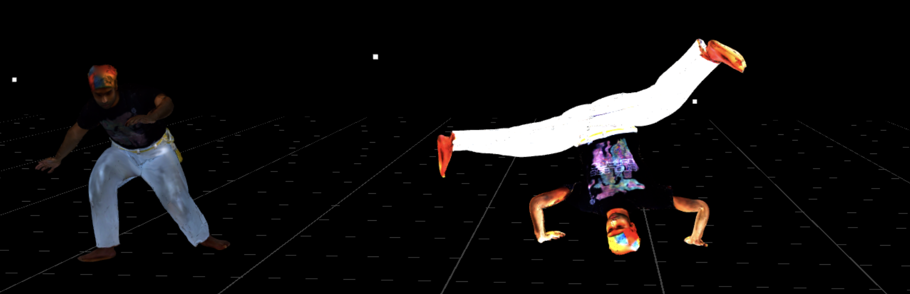

# capoeira

A photogrammetry scan of myself doing a martial arts movement in a WebXR scene.

## How/Why
One late night after capoeira practice, [Sofia](https://www.instagram.com/sofia_dlv/) and I went to Danny Andreev of [Sunburn Schematics](https://sunburnschematics.com/) for tea. He showed us this photogrammetry device that is usually used to capture 3D scans of parts for later use in a CAD context. We hypothesized that if I stayed *really*,*really* still we could capture it as a 3D file, and that I could use auto-rigging software to try to fight myself in VR.

[A reel of a process video](https://www.instagram.com/reel/Czha00DSP-6/?utm_source=ig_web_copy_link&igsh=MzRlODBiNWFlZA==)

This ended up being a useful prototype to communicate to fellow VR developers and locals in the HCI community about potentials for interpersonal martial interaction in XR that can extend beyond the status quo of punching -- what would it look like to be in a movement dialog with an expressive artifical avatar that can cartwheel, kick, spin, and dance.

Later, [Kiki](https://github.com/KikiSpace) helped me put a muay thai movement in there-- more to come 😎

## Run this locally
`npm install`
`npm run dev`

## More resources
Auto rigging + animation library - [Mixamo](https://www.mixamo.com/)

How to animate with three.js - [Three.js Journey Lesson 05](https://threejs-journey.com/lessons/animations)
